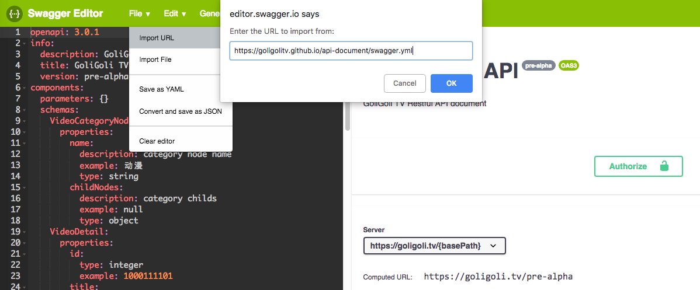

# GoliGoli tv restful API document

[](https://travis-ci.org/GoliGoliTV/api-document)
[](https://opensource.org/licenses/MIT)
[](https://www.repostatus.org/#wip)

GoliGoli tv restful API document
[Github Pages](https://goligolitv.github.io/api-document/)

## Discussion

It's recommended to discuss api related questions on GitHub issues.

## Contribution guide

GoliGoli TV API doc is written in accordance with `OpenAPI 3` specification.
Complete document of `OpenAPI 3` specification can be found [here](https://swagger.io/docs/specification/about/).

For those would like to contribute to the GoliGoli TV API document, the **only** file of interest is `./swagger.yml`. So never touch the other files of this repo.

Open the `swagger.yml` file in text editor you like or in swagger editor, and have fun.

## Simplified Guides on OpenAPI specification

Complete document of `OpenAPI 3` specification can be found [here](https://swagger.io/docs/specification/about/).

A full functional example of OpenAPI 3 document:

```yaml
openapi: 3.0.0
info:
  title: Sample API
  description: Optional multiline or single-line description in [CommonMark](http://commonmark.org/help/) or HTML.
  version: 0.1.9

servers:
  - url: http://api.example.com/v1
    description: Optional server description, e.g. Main (production) server
  - url: http://staging-api.example.com
    description: Optional server description, e.g. Internal staging server for testing

components:
  securitySchemes:
    bearerAuth: { bearerFormat: JWT, scheme: bearer, type: http }
  schemas:
    User:
      properties:
        id:
          type: integer
        name:
          type: string
      # Both properties are required
      required:
        - id
        - name

paths:
  /users:
    get:
      summary: Returns a list of users.
      description: Optional extended description in CommonMark or HTML.
      responses:
        "200": # status code
          description: A JSON array of user names
          content:
            application/json:
              schema:
                type: array
                items:
                  type: string
```

- The `info` section contains API information: title, description (optional), version
- The `servers` section specifies the API server and base URL. You can define one or several servers, such as production and sandbox.
- Input and Output Models

  The global `components/schemas` section lets you define common data structures used in your API. They can be referenced via `$ref` whenever a schema is required – in parameters, request bodies, and response bodies.

  For example, this JSON object:

  ```json
  {
    "id": 4,
    "name": "Arthur Dent"
  }
  ```

  can be represented as:

  ```yaml
  components:
    schemas:
      User:
        properties:
          id:
            type: integer
          name:
            type: string
        # Both properties are required
        required:
          - id
          - name
  ```

  and then referenced in the request body schema and response body schema as follows:

  ```yaml
  paths:
    /users/{userId}:
      get:
        summary: Returns a user by ID.
        parameters:
          - in: path
          name: userId
          required: true
          type: integer
        responses:
          '200':
          description: OK
          content:
            application/json:
              schema:
                $ref: '#/components/schemas/User'
  ```

- The `paths` section defines individual endpoints (paths) in your API, and the HTTP methods (operations) supported by these endpoints.**Most contributor will only need to edit paths section.**

  For example, GET /users can be described as:

  ```yaml
  paths:
    /users:
      get:
        summary: meow
        description: meow
        parameters: ...
        responses: ...
  ```

  and POST /users with JSON can be:

  ```yaml
  paths:
    /users:
      post:
        summary: meow
        description: meow
        requestBody: ...
        responses: ...
  ```

  - parameters

    Operations can have parameters passed via :

    - URL path (/users/{userId})-
    - query string (/users?role=admin)
    - headers (X-CustomHeader: Value)
    - cookies (Cookie: debug=0).

    Set the parameters->in to `query`, `path`, or `headers`.

    You can define the parameter data types, format, whether they are required or optional, and other details:

    ```yaml
    parameters:
      - name: userId
        in: path
        required: true
        description: Parameter description in CommonMark or HTML.
        schema:
          type: integer
          format: int64
          minimum: 1
    ```

  - Request Body (Json request)

    If an operation sends a request body, use the `requestBody` keyword to describe the body content and media type.

    ```yaml
    paths:
      /users:
        post:
          summary: Creates a user.
          requestBody:
            required: true
            content:
              application/json:
                schema:
                  type: object
                  properties:
                    username:
                      type: string
          responses:
            "201":
              description: Created
    ```

  - Responses

    For each operation, you can define possible **status codes**, such as 200 OK or 404 Not Found, and the response body schema.

    Schemas can be defined inline or referenced via $ref. You can also provide example responses for different content types:

    ```yaml
    paths:
      /user/{userId}:
        get:
          summary: Returns a user by ID.
          parameters:
            - name: userId
              in: path
              required: true
              description: The ID of the user to return.
              schema:
                type: integer
                format: int64
                minimum: 1
          responses:
            '200':
              description: A user object.
              content:
                application/json:
                schema:
                  type: object
                  properties:
                    id:
                      type: integer
                      format: int64
                      example: 4
                    name:
                      type: string
                      example: Jessica Smith
            '400':
              description: The specified user ID is invalid (not a number).
            '404':
              description: A user with the specified ID was not found.
            default:
              description: Unexpected error
    ```

## Development Environment guide

[swagger](https://swagger.io/) has devised a online [editor](https://swagger.io/tools/swagger-editor/) written in JavaScript. So besides writing yaml file in whatever text editor or IDE you like, you can take use of this editor.

### Swagger Editor

#### Online editor

Import GoliGoli TV api doc into [swagger online editor](https://editor.swagger.io/).

This website is slow from mainland China.

#### Local editor

Get the latest [release of swagger-editor](https://github.com/swagger-api/swagger-editor/releases), and open the `index.html` file.

#### Docker

##### Running the image from DockerHub

There is a docker image published in [DockerHub](https://hub.docker.com/r/swaggerapi/swagger-editor/).

To use this, run the following:

```bash
$ docker pull swaggerapi/swagger-editor
$ docker run -d -p 80:8080 swaggerapi/swagger-editor
```

This will run Swagger Editor (in detached mode) on port 80 on your machine, so you can open it by navigating to `http://localhost` in your browser.

##### Building and running an image locally

To build and run a docker image with the code checked out on your machine, clone the [swagger-editor](https://github.com/swagger-api/swagger-editor) project, and run the following from the root directory of the project:

```bash
$ git clone https://github.com/swagger-api/swagger-editor

$ cd swagger-editor

# Install npm packages (if needed)
$ npm install

# Build the app
$ npm run build

# Build an image
$ docker build -t swagger-editor .

# Run the container
$ docker run -d -p 80:8080 swagger-editor
```

You can then view the app by navigating to `http://localhost` in your browser.

### Importing OpenAPI documents

Swagger Editor can import your OpenAPI document, which can be formatted as JSON or YAML.

#### File → Import File

Click **Choose File** and select import. The file you are importing has to be a valid JSON or YAML OpenAPI document. Swagger Editor will prompt you about validation errors, if any exist.

#### File → Import URL

Paste the URL to your OpenAPI document.



#### Drag and Drop

Simply drag and drop your OpenAPI JSON or YAML document into the Swagger Editor browser window.


